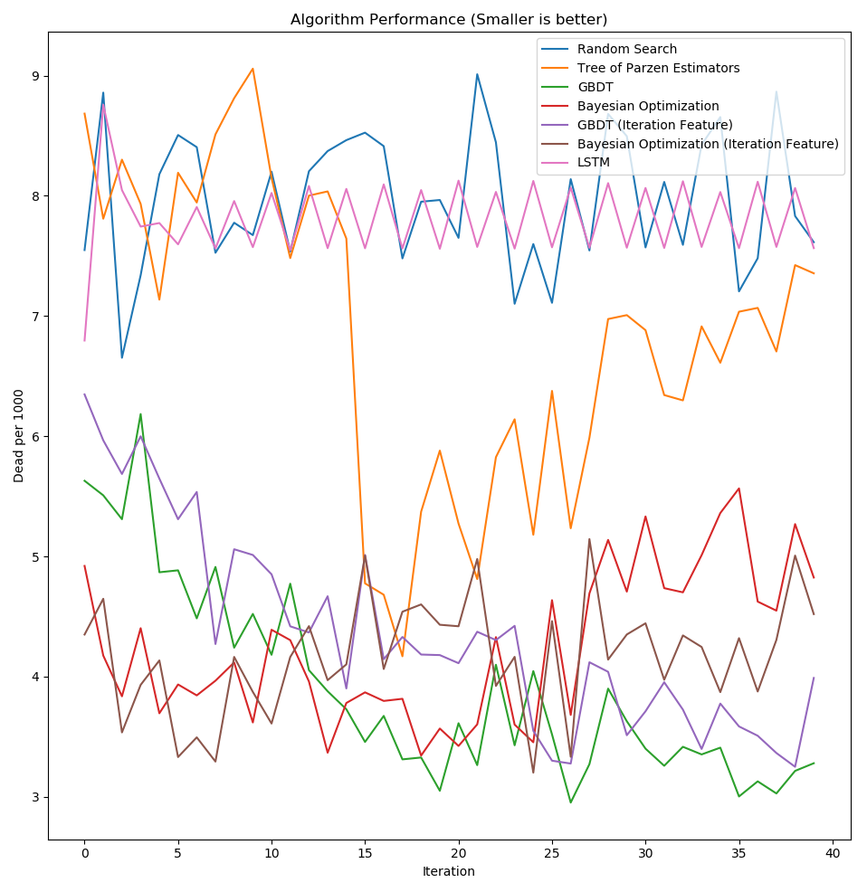
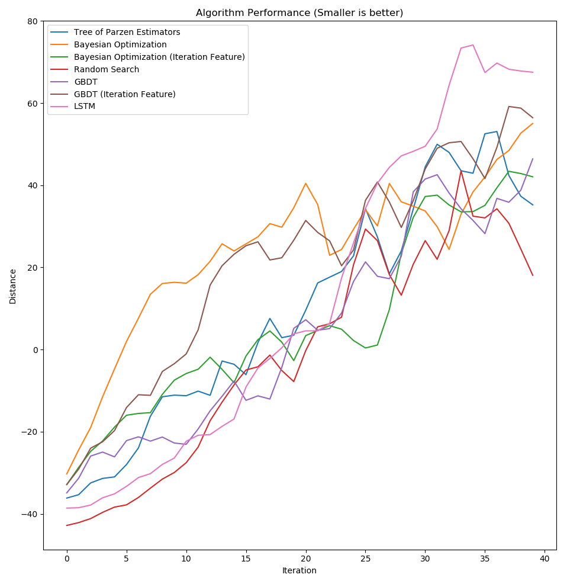
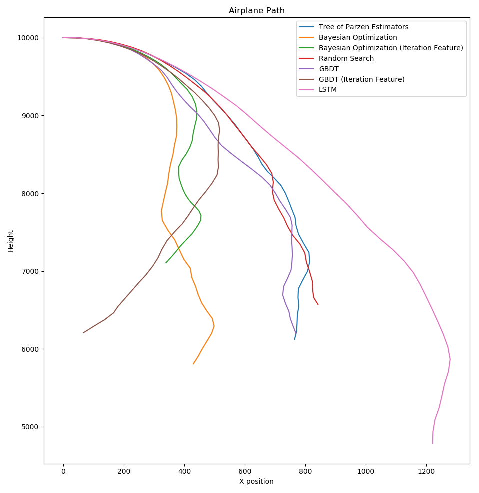
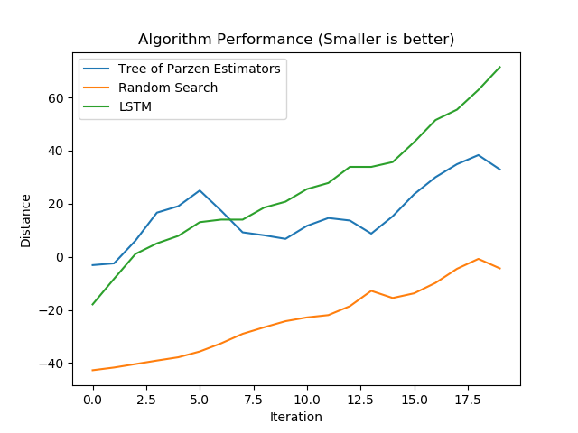
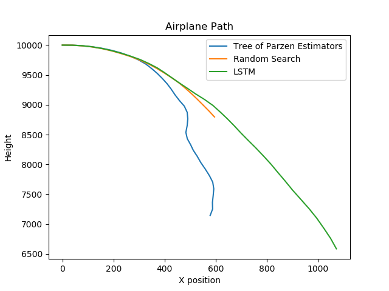

\begin{abstract}
Current research into global black box optimization of expensive functions
focuses on stateless models such as machine learning hyper parameter
optimization. Many real world problems cannot be reset back to a clean state
after a single evaluation. In this paper, we evaluate the performance of five
popular black box algorithms on two stateful models: governmental budgeting and
flying an airplane. We find that current black-box optimization methods do not
sufficiently deal with noisy functions, especially when that noise is highly
dependent on previous parameters, and dominates the function output.
\end{abstract}

# Introduction

For our project, we were interested in the area of black-box optimization.
Many engineering simulations and problems exist in a complex problem space
without easy access to gradients, and often where function evaluation itself
is extremely expensive. In these kinds of situations, easy solutions like
gradient descent are out of scope, and others like Monte Carlo methods are
prohibitively expensive.

We wanted to explore the specific case of stateful black-boxes. These are
functions whose output is noisy, and whose noise depends on previous
parameters. This includes situations like government budgeting, where each
year feels the impact of previous years, or flying an airplane, where each
second the plane continues to feel the impact of previous control movements.

By exploring various methods on these stateful models, we hope to gain an
understanding for how existing methods fare in the presence of stateful models.

# Related Work

## @bb-rnn and @chen2016learning

These papers take a reasonably popular approach: build a differentiable model of
the function, and perform gradient descent on that model. In particular, the
authors of the above papers build a Gaussian process from samples of the
black-box function, and then train a long short-term memory recurrent neural
network to minimize that Gaussian process. This method has the advantage of
learning latent factors that impact optimization, and so are less dependent on
the underlying response surface model used. Like other papers, these papers
investigate the performance of this method on noiseless functions. The authors
in both of these papers make claims about the performance of their methods,
which we wanted to evaluate in a slightly context.

## @hansen2010comparing

There is a considerable amount of prior work in the area of black-box
optimization. This paper in particular compares 31 methods against the BBOB-2009
functions, which vary in their complexity and their difficulty in optimization.
Generally, this paper found that the best method to use depends heavily on the
dimensionality of the problem. In general, the more complex the function, the
tougher it is to optimize. We wanted to extend this analysis to noisy functions,
which this paper does not address. In particular, we wanted to evaluate current
methods against very noisy functions.

## @jones1998efficient

This earlier paper on black-box optimization explores the space of response
surfaces, and using those surfaces to select further points of interest. We
implement a method along these lines to compare against. This method involves
measuring expected improvement, which is a combination of minimum value and
error at a certain point on the response surface. Using more robust statistical
methods to search the function space of a black-box function makes sense, given
the computational cost of evaluating the method itself. We wanted to extend this
analysis to stateful black-box functions, as a kind of baseline to compare other
popular methods against.

# Description and Justification

Our project involves testing various black-box optimization methods on stateful
functions. This means our project has essentially two components: the models to
train against, and the models to be trained. We selected both on the basis of
varying complexity, in order to get a broader understanding of the current space
of black-box optimization.

## Algorithms

We selected our algorithms on the basis of current state-of-the-art optimization
packages, as well as from trends in machine learning. These models vary in their
complexity, and very in turn in their performance. For some of these models, we
implemented a variant that includes the iteration number as a feature. This
essentially turns these models into a time-series model, which is an appropriate
approach to take in the case of stateful functions.

### Random Search

Random search is one of the simplest black box optimization algorithms. In a
typical implementation, it randomly guesses points within the bounds and then
takes the smallest value as the best option.  Since we are modeling continuous
processes, we do not ever take a fixed "best" value and always randomize at each
iteration. This is used as a baseline for the other algorithms.

### Gradient Boosted Decision Trees (GBDT)

One common solution to black box optimization is to train a model on top of all
the sampled points and then minimize over the model to pick the next point. At
each step our implementation trains a set of gradient boosted decision trees
using the CatBoost library [@CatBoost]. To find the global minimum of the model
we pick 100 random points within the search space and then use L-BFGS-B
[@byrd1995limited] to find the local minimum. We use the best of those 100 local
minima as the next search point.

We test two versions of this model. The first has just the model parameters
we are interested in, and the second additionally has the iteration number.
Adding the iteration number provides a limited way to model the changing hidden
state.

### Bayesian Optimization (Gaussian Processes)

This method uses Gaussian Processes to build a model of the original function
which we then use to find the point to maximize the expected improvement. This
is a very popular hyper parameter optimization algorithm and is used as the
default at several large companies including Google
[@Golovin:2017:GVS:3097983.3098043].
For our tests, we use the BayesOpt library [@JMLR:v15:martinezcantin14a].

We test the same two variants of input parameters for this model as we did with
GBDT.

### Tree-structured Parzen Estimator

A Tree-structured Parzen Estimator [@bergstra2011algorithms] is another
algorithm that has fairly decent performance for hyper parameter optimization.
We used the HyperOpt library [@bergstra2013hyperopt] with the TPE minimizer.

This model was tested with only the input parameters due to inflexibility of the
library.

### LSTM based Recurrent Neural Network

We implemented the model as described in @bb-rnn. The problem of black box
optimization can be formulated as the problem of finding the sequence containing
the minimum value of a black box function. This formulation can be used to fit a
Long Short Term Memory neural network. This method essentially uses an LSTM to
learn how to minimize the function, rather than using a gradient.

At every step, the rnn $LSTM$ determines the next step to take.

\begin{align*}
x_n, h_n &= LSTM(x_{n - 1}, y_{n - 1}, h_{n - 1})\\
y_n &= \psi(x_n)
\end{align*}

Where $\psi(x) = E[GP(x)]$, the expected value of the Gaussian process model at
point $x$.

Our implementation of this method uses Tensorflow [@tensorflow2015-whitepaper],
making use of its LSTM framework. We also make use of GPflow [@GPflow2017] for
creating our Gaussian processes.

This method is obviously heavily dependent on the exact form of the Gaussian
process. We started with the simplest case of a "vanilla" Gaussian process using
radial basis functions for the kernels. This approach yielded poor results
since with only a few data points to train on, most of the function space is
predicted to be zero. Using a summed Matern and Linear kernel, performance can
beat Bayesian optimization.

## Models

To evaluate these algorithms we trained them on two stateful models. Each model
has a single function that needs to be optimized with $n$ parameters as well as
bounds for the range of values that can be accepted.

### Death Rate

Many real life models, such as governmental budgeting, are nearly impossible to
evaluate. Instead, we built a stateful model of a governmental budget, and used
it as a target of various black-box optimization methods. We created a simple
model by using the World Bank Development Indicators and training a Gradient
Boosted Decision Tree to predict deathrate based off of expenditures in
education, health, R&D and military [@WB]. To add a stateful component to this,
we added momentum, such that changing the parameters produces lag with respect
to the death rate.

While this is a very simple model, it does provide some realistic behaviors.
Many large systems have a high latency between cause and effect. We are also
primarily interested in highlighting the differences between these algorithms.

We bound the inputs to be within two times the maximum existing value for that
expenditure category and greater than zero.

### Airplane

The second model is that of flying an airplane. The Python Flight Mechanics
Engine is a project attempting to model every aspect of flying a plane [@PyFME].
We used it to model flying a plane to a location. The model takes in the
throttle as well as the position of the elevator, aileron and rudder and outputs
the distance the plane has flown towards the target. This model has numerous
stateful variables that need to be modeled including position, rotation,
velocity, direction. There are also many nonlinearities due to things like air
resistance and gravity.

This model uses the Cessna 172 as a base and bounds the inputs to be match the
actual control range of the aircraft.

# Experiments and Analysis

For all of our experiments, we initialized the models with five "free" random
historical data points, and then used those models to predict the next 40
data points, updating the models at each step.

Commonly Bayesian Optimization methods start out with a series of random points
to get an initial overview of the space. Our data shows that this leads to very
poor performance with stateful models as 5 initial bad points can lead the model
to a poor state before being able to recover.

The results below are the mean of 20 iterations. Individual runs tend to vary
too much to get a clean comparison between methods.

## Death Rate

The death rate model is the simpler of the two to model. In general, all methods
except for LSTM performed on average better than random. LSTM in particular only
sometimes managed to learn something about how to minimize the actual function,
which meant on average performance like random. In this case, gradient-boosted
decision trees performed the best, followed by Bayesian optimization.

Adding iteration count as a feature doesn't seem to improve accuracy with this
model and in the case of GBDT makes it worse. This intuitively makes sense since
with momentum only the previous iteration affects the result.

Method                                       Dead per 1000    Final    Time (s)
-----------------------------------------  ---------------  -------  ----------
Bayesian Optimization                              169.943  4.82427  270.191
Bayesian Optimization (Iteration Feature)          166.688  4.51994  230.342
GBDT                                               156.194  3.2796   126.613
GBDT (Iteration Feature)                           174.163  3.98914  133.977
LSTM                                               312.352  7.56452  120.985
Random Search                                      318.699  7.6137     0.157484
Tree of Parzen Estimators                          274.014  7.35505    0.740803

## Airplane

For these results "Distance" is the distance flown away from the target point.
The smaller the number, the closer the plane was to the target point.

With the airplane model being more complex, it makes sense that every method
performed worse. Generally, no method performed better than random on our loss
function, although the different methods we tried resulted in different paths
taken by the plane. In particular, LSTM managed to fly the plane the furthest.
The same effect is present here as well: five historical points is too few to
accurately learn much about the behavior of the function.

Adding the iteration feature has mixed results with these models. With Bayesian
Optimization, it significantly improves how far the plane was able to fly towards
the target. With GBDT, it has much worse performance. This is likely due to how
the models handle points outside their training domain. Since GBDT is based off
of decision trees, it performs well within the area it's seen before, but since
the iteration count is always increasing the points sampled are always outside
the model domain. With Bayesian Optimization, the model produced by the Gaussian
processes is smooth outside the data domain and likely generalizes better when
sampling outside. The iteration feature also allows for it to "forget" older
points if they conflict with newer data.

Method                                       Distance    Final    Time (s)
-----------------------------------------  ----------  -------  ----------
Bayesian Optimization                        951.158   55.0508    186.141
Bayesian Optimization (Iteration Feature)    254.179   42.0604    100.786
GBDT                                         170.037   46.4255    266.083
GBDT (Iteration Feature)                     828.039   56.438     186.172
LSTM                                         483.213   67.5271    200.627
Random Search                                -45.2105  18.0915     65.4368
Tree of Parzen Estimators                    386.751   35.2345     87.0953

We investigated the impact of a greater number of starting samples with the
airplane model. We compared performance for LSTM, TPE, and random search in
this setting. This did not seem to improve the performance of those 
algorithms in terms of loss, but LSTM manages to stay closer to random than 
TPE in the actual flight path of the plane.

# Discussion and Future Work

We found that existing methods are poor at dealing with complex, very stateful
models. This is especially obvious in the case of flying an airplane: many
models did worse than random. In the simpler case of a momentum method, where
the output of the function is not very impacted by previous iterations, the
black-box methods we implemented perform better.

This is in line with the related work in the area. Many papers, such as
@hansen2010comparing, are restricted to noiseless functions. The most direct
approach to tackle this problem would be to create a model of the noise itself.
In the case of highly stateful functions, this model would necessarily be
complex. Given the methods we implemented do not attempt to model the noise in
the functions they optimize, it is not surprising that they perform poorly when
the function is highly stateful.

Our results are a modest sampling of methods, but clearly a larger sample of
more methods would be even better. Our model of government budgeting is a simple
momentum model, but in reality, a more complex, multi-year momentum in a higher
number of dimensions would be a more accurate model of the impact of government
budgets.

One area for future exploration is time series models in particular. We
decided to investigate general black-box optimization algorithms which
generalized poorly to stateful and time-series functions.

Another area for future exploration may be to do more feature engineering. We
explored iteration count as a feature, but other things such as passing in the
previously outputted value or previous parameters into the model may also
improve results.

\newpage

# References
